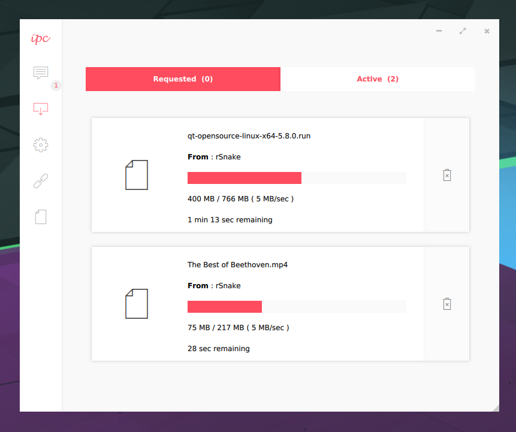

# IPConnect

P2P Chat and File Transfer Desktop Application for LAN Liscenced under GPLv3.0 ( see LISCENCE ).



### Requirements
* cmake 3.5.1
* Qt 5.8 libs

### Compiling
* if Qt 5.8 is installed globally
```
$ mkdir build && cd build
$ cmake ..
$ make && make install
```
* if Qt 5.8 is installed at a specific path
```
$ mkdir build && cd build
$ cmake -DCMAKE_PREFIX_PATH=/path/to/Qt5.8.0/ ..
$ make && make install
```

### Using
see [Using.md](Using.md)
