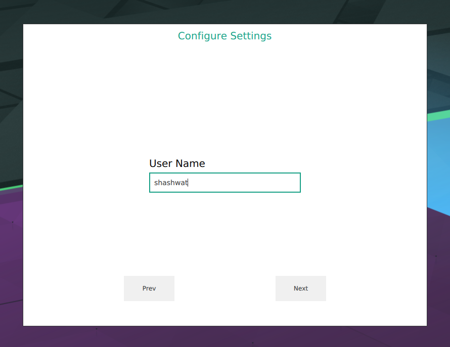
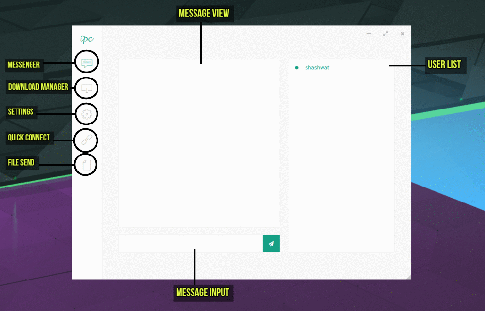
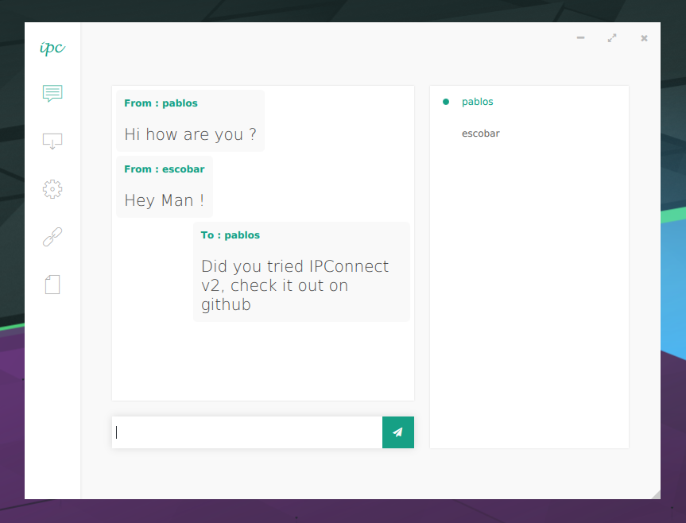
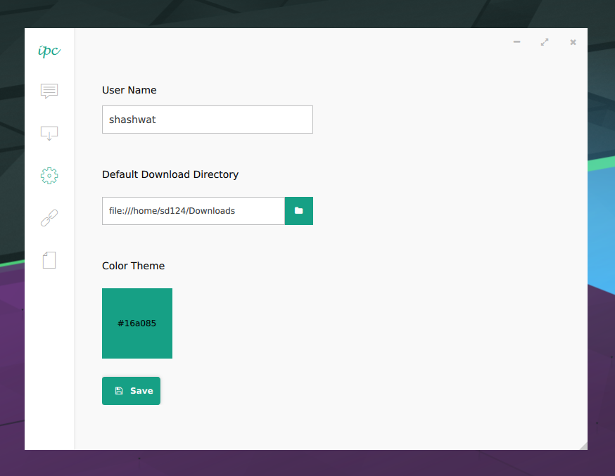
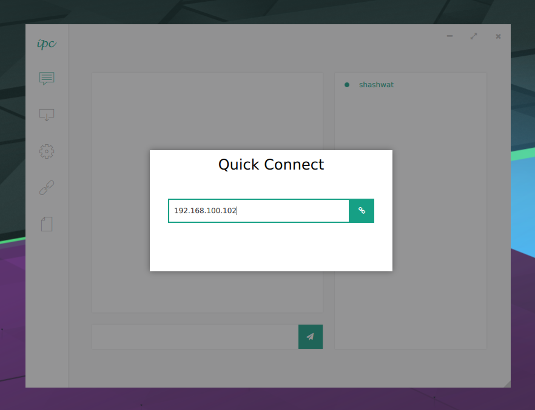
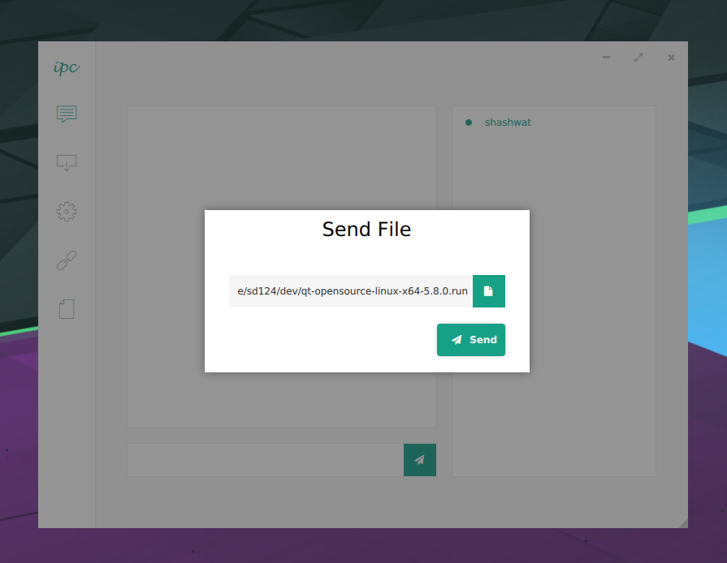
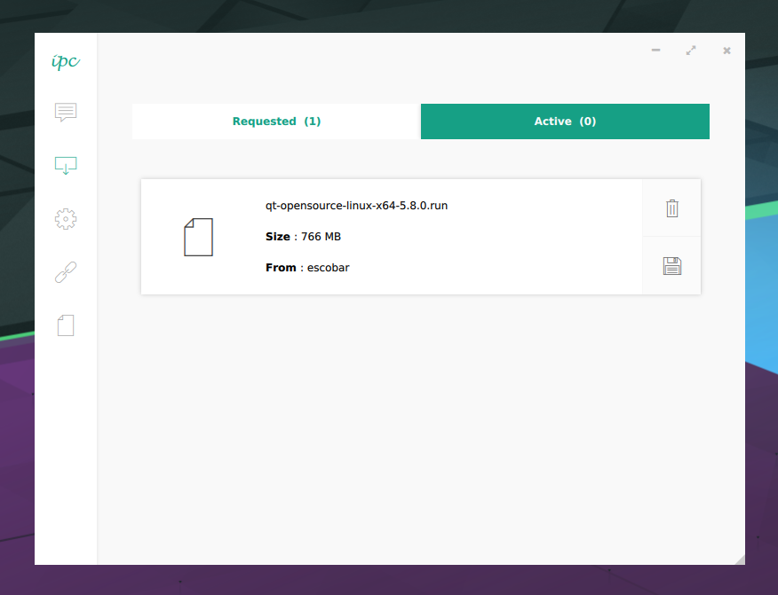
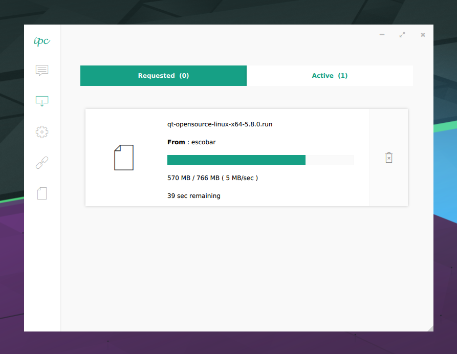

## Using IPConnect

##### Configure Settings
When IPConnect is started for the first time it asks user for username , default download dir , and color theme preference which can be changed later in Settings menu

##### Basic Tools

##### Messenger
Messenger is used to chat and show messages from other users

##### Settings
User can change basic information and color theme set on startup

##### QuickConnect
User can connect to an ip address manually

##### Send File
User can select a file to send which will be send as Transfer Request to selected user in user list

##### Requested Transfer
Whenever some user sends a file it will be shown in Requested Tab in Download manager, where user can choose to accept or reject the file.

##### Active Transfer
If a user accepts a file request from Requested Tab it will be shown in Active Tab untill transfered. Shows Progress, Downloaded Size , Transfer Rate and Time Remaining for Transfers.

